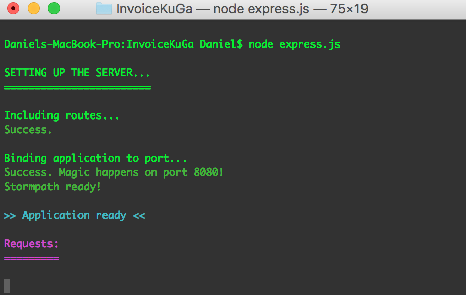

# InvoiceKuGa

The purpose of the application is to create invoices and it is possible to administer customers and customer contacts.
Furthermore, the application supports the generation of statistics and charts to analyse the revenues.

## Installation

`Node.js` needs to be installed to run the application. [Install Node.js here.](https://nodejs.org/en/download/)
After the installation has completed, go to the root folder of the application and run the following command:

```
npm install
```

This command installs all dependencies of the application which were specified in the `package.json` file.
This is what the `package.json` file looks like (example):

```json
{
  "name": "invoice_app_kuga",
  "version": "1.0.0",
  "description": "",
  "main": "express.js",
  "author": "Daniel Wehner",
  "license": "ISC",
  "dependencies": {
    "colors": "^1.1.2",
    "express": "^4.14.0",
    "express-stormpath": "^3.1.3",
    "html-pdf": "^2.0.1",
    "mustache": "^2.2.1",
    "pg": "^6.0.3",
    "serve-favicon": "^2.3.0"
  },
  "scripts": {
    "start": "node express.js"
  }
}
```

Repeat this procedure in the `frontend` (Angular frontend) folder of the application to install the frontend dependencies.
You also have to install `PostgreSQL` which will be used as a database. In order to avoid any errors when connecting to the database make sure you change the connection string in the `db.js` file accordingly.

## Start the Application

In order to start the application, go to the root folder of the application and run the following command (if the `sapui5` parameter is specified the `SAPUI5` frontend will be loaded):

```
node express.js [sapui5]
```

or (loads the `SAPUI5` frontend by default)

```
npm start
```

The `express.js` file is the entry point of the `Node.js` application. All API endpoints are defined there and all the configuration is made there. The application now listens on port `8080`.



## API Documentation

### Customer Endpoints

**GET:**

- `http://<host>:8080/customers`:  
  Returns a list of all customers.
- `http://<host>:8080/customers/:id`:  
  Returns the customer with id `id`.
- `http://<host>:8080/customers/:id/islocked`:  
  Returns `true` if the customer with id `id` is currently locked by another user.

**POST:**

- `http://<host>:8080/customers`:  
  Adds a new customer. The data has to be sent in the request body:

  ```json
    {
        "address": "...",
        "firstname": "...",
        "lastname": "...",
        "street": "...",
        "zip": "...",
        "city": "..."
    }
  ```

- `http://<host>:8080/customers/:id/lock`:  
  Locks the customer record with id `id`.
- `http://<host>:8080/customers/:id/unlock`:  
  Unlocks the customer record with id `id`.

### Invoice Endpoints

**GET:**

- `http://<host>:8080/invoices`:  
  Returns a list of all invoices.
- `http://<host>:8080/invoices/:id`:  
  Returns the invoice with id `id`.
- `http://<host>:8080/invoices/:id/print`:  
  Creates pdf for the invoice with id `id`.
- `http://<host>:8080/invoices/:id/positions`:  
  Returns all invoice positions for the invoice with id `id`.

**POST:**

- `http://<host>:8080/invoices`:  
  Adds a new invoice. The data has to be sent in the request body:

  ```json
    {
        "customer": {
            "id": "..."
        },
        "invoice": {
            "description": "...",
            "date": "...",
            "deliveryDate": "...",
            "room": "..."
        }
    }
  ```

- `http://<host>:8080/invoices/:id/positions`:  
  Adds a new invoice position to the invoice with id `id`.

### Statistics Endpoints

**GET:**

- `http://<host>:8080/statistics/evt-rev-by-month?name=value`:  
  Returns the event revenue statistics grouped by months.  

  **Query parameters:**

  | name    | values       | description                                                   |
  | ------- | ------------ | ------------------------------------------------------------- |
  | *gross* | true, false  | true := returns gross revenues, false := returns net revenues |   

- `http://<host>:8080/statistics/evt-rev-by-customer?name=value`:   
  Returns the event revenue statistics grouped by customers.  

  **Query parameters:**  

  | name    | values       | description                                                   |
  | ------- | ------------ | ------------------------------------------------------------- |
  | *gross* | true, false  | true := returns gross revenues, false := returns net revenues |
  | *limit* | integer      | limits the number of result rows to *limit* (default: 10)     |

- `http://<host>:8080/statistics/ce-rev`:  
  Returns the cash earnings revenue.

### Cash Earnings Endpoints

**GET:**

- `http://<host>:8080/daily-cash-earnings`:  
  Returns a lits of all cash earnings.

**POST:**

- `http://<host>:8080/daily-cash-earnings`:  
  Adds a new cash earning.

**DELETE:**

- `http://<host>:8080/daily-cash-earnings/:id`:  
  Deletes the cash earning with id `id`.

## Debugging Node.js Backend

Debugging is an integral part of the development process. For debugging a `Node.js` application it is recommended to use
the `Node Inspector` which can be installed by executing the following commad in the terminal:

```
npm install -g node-inspector
```

This installs the `Node Inspector` globally. (This is very important!) The debugger can be started like this:

```
node-debug express.js
```

After that the debugger listens on port `5858` on your local machine.
(The browser should open automatically.)


Now the application can be debugged very easily (like normal frontend `JavaScript`).
